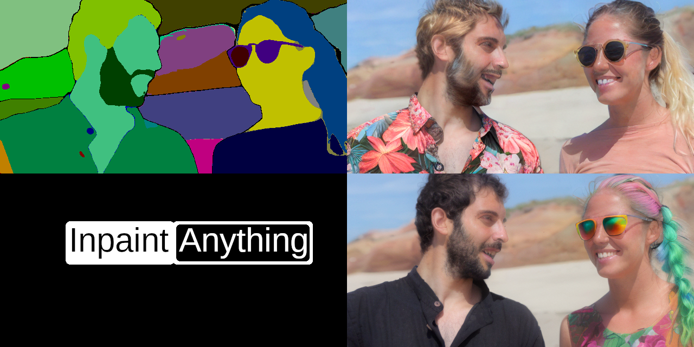

# Inpaint Anything (Inpainting with Segment Anything)

Inpaint Anything performs stable diffusion inpainting on a browser UI using any mask selected from the output of [Segment Anything](https://github.com/facebookresearch/segment-anything).


Using Segment Anything enables users to specify masks by simply pointing to the desired areas, instead of manually filling them in. This can increase the efficiency and accuracy of the mask creation process, leading to potentially higher-quality inpainting results while saving time and effort.

[Extension version for AUTOMATIC1111's Web UI](https://github.com/Uminosachi/sd-webui-inpaint-anything)



## Installation

Please follow these steps to install the software:

* Create a new conda environment:

```bash
conda create -n inpaint python=3.10
conda activate inpaint
```

* Clone the software repository:

```bash
git clone https://github.com/Uminosachi/inpaint-anything.git
cd inpaint-anything
```

* For the CUDA environment, install the following packages:

```bash
pip install -r requirements.txt
```

* If you are using macOS, please install the package from the following file instead:

```bash
pip install -r requirements_mac.txt
```

## Running the application

```bash
python iasam_app.py
```

* Open http://127.0.0.1:7860/ in your browser.
* Note: If you have a privacy protection extension enabled in your web browser, such as DuckDuckGo, you may not be able to retrieve the mask from your sketch.

## Downloading the Model

To download the model:

* Launch this application.
* Click on the `Download model` button located next to the [Segment Anything Model ID](https://github.com/facebookresearch/segment-anything#model-checkpoints) that include [Segment Anything in High Quality Model ID](https://github.com/SysCV/sam-hq) and [Fast Segment Anything](https://github.com/CASIA-IVA-Lab/FastSAM).
  * The SAM is available in three sizes. The sizes are: Base < Large < Huge. Please note that larger sizes consume more VRAM.
* Wait for the download to complete.
* The downloaded model file will be stored in the `models` directory of this application's repository.

## Usage

* Drag and drop your image onto the input image area.
  * Outpainting can be achieved by the `Padding options`, configuring the scale and balance, and then clicking on the `Run Padding` button.
* Click on the `Run Segment Anything` button.
* Use sketching to point the area you want to inpaint. You can undo and adjust the pen size.
* Click on the `Create mask` button. The mask will appear in the selected mask image area.

### Mask Adjustment

* `Expand mask region` button: Use this to slightly expand the area of the mask for broader coverage.
* `Trim mask by sketch` button: Clicking this will exclude the sketched area from the mask.

### Inpainting Tab

* Enter your desired Prompt and Negative Prompt, then choose the Inpainting Model ID.
* Click on the `Run Inpainting` button (**Please note that it may take some time to download the model for the first time**).
  * In the Advanced options, you can adjust the Sampler, Sampling Steps, Guidance Scale, and Seed.
  * If you enable the `Mask area Only` option, modifications will be confined to the designated mask area only.
* Inpainting process is performed using [diffusers](https://github.com/huggingface/diffusers).
* Tips: You can directly drag and drop the inpainted image into the input image field on the Web UI.

### Cleaner Tab

* Choose the Cleaner Model ID.
* Click on the `Run Cleaner` button (**Please note that it may take some time to download the model for the first time**).
* Cleaner process is performed using [Lama Cleaner](https://github.com/Sanster/lama-cleaner).

### Mask only Tab

* Gives ability to just save mask without any other processing, so it's then possible to use the mask in other graphic applications.
* `Get mask as alpha of image` button: Save the mask as RGBA image, with the mask put into the alpha channel of the input image.
* `Get mask` button: Save the mask as RGB image.


## Auto-saving images

* The inpainted image will be automatically saved in the folder that matches the current date within the `outputs` directory.
* If you would also like to save the segmented images, run the Python script with the following argument:
  * `--save_segment` Save the segmentation image generated by the SAM output.

## License

The source code is licensed under the [Apache 2.0 license](LICENSE).

## Reference

* Kirillov, A., Mintun, E., Ravi, N., Mao, H., Rolland, C., Gustafson, L., Xiao, T., Whitehead, S., Berg, A. C., Lo, W-Y., Dollár, P., & Girshick, R. (2023). [Segment Anything](https://arxiv.org/abs/2304.02643). arXiv:2304.02643.
* Ke, L., Ye, M., Danelljan, M., Liu, Y., Tai, Y-W., Tang, C-K., & Yu, F. (2023). [Segment Anything in High Quality](https://arxiv.org/abs/2306.01567). arXiv:2306.01567.
* Zhao, X., Ding, W., An, Y., Du, Y., Yu, T., Li, M., Tang, M., & Wang, J. (2023). [Fast Segment Anything](https://arxiv.org/abs/2306.12156). ArXiv:2306.12156 [cs.CV].